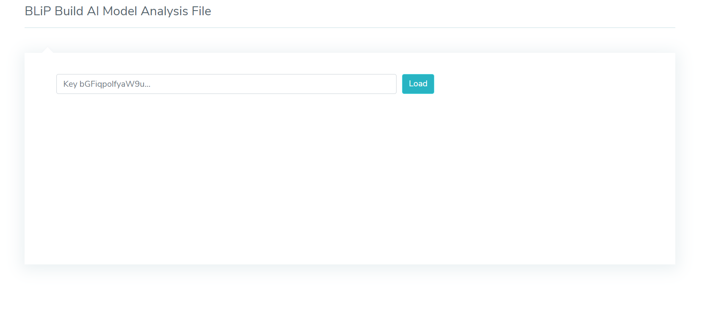
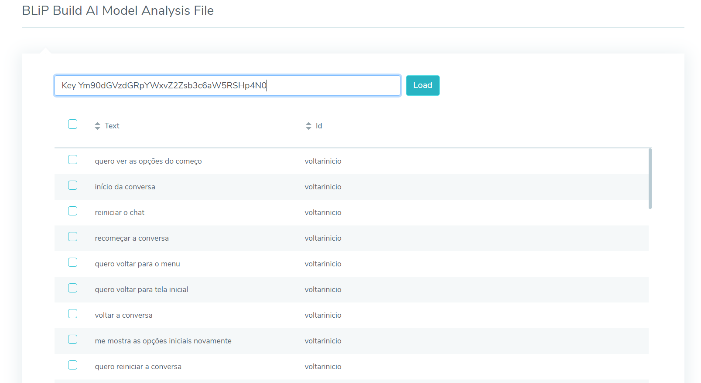
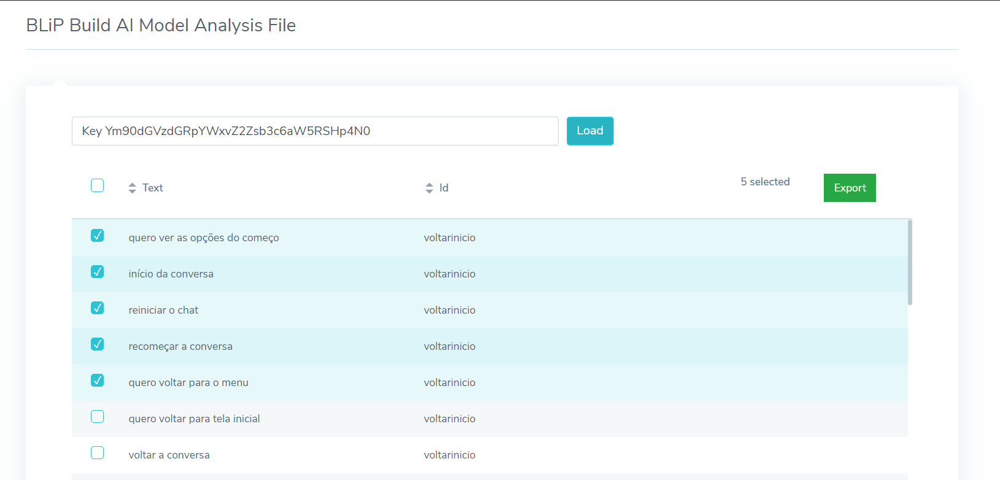
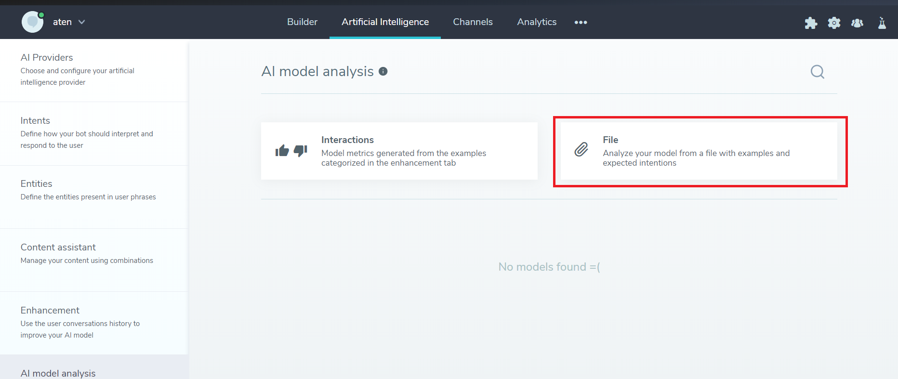

# BLiP Build AI Model Analysis File

 This is a BLiP tool made to help users to build  AI Model Analysis File with ease.

 Visit the sample [page here](https://blip-build-ai-model-analysis-file.netlify.app).

## How can I export the file

1. Present your [key authorization](https://help.blip.ai/docs/en/api-sdks/como-encontrar-a-api-key-do-meu-bot/#docsNav) and click to load.

2. All intents and user text will be presented.

3. Select all tuples that you want and click to export.

4. Import the file exported into your bot.

## Getting started from this project

1. Download or clone the project from `git`(the recommended way):

`git clone https://github.com/takenet/blip-tools.git`

2. Install all packages from npm:

`cd BLiP Build AI Model Analysis File && npm install`

3. Run the project:

`npm start`

4. Now just add the plugin to your chatbot and enjoy!

