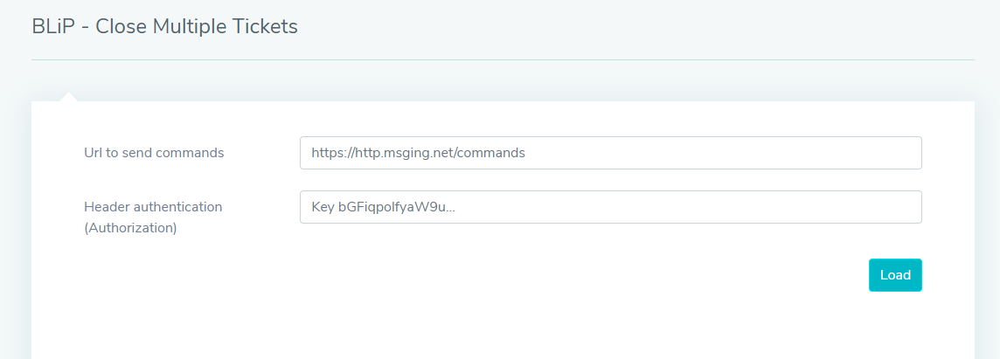
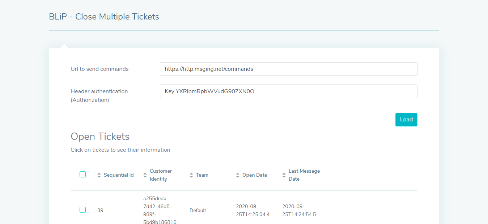
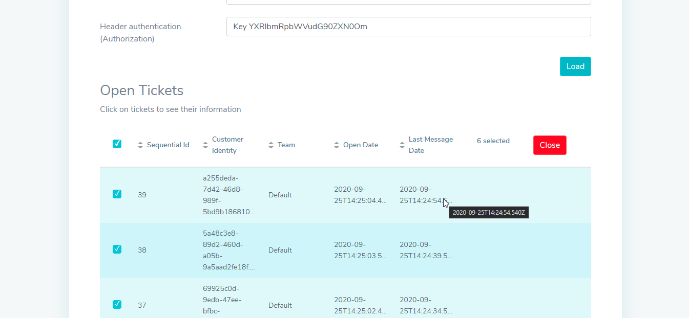
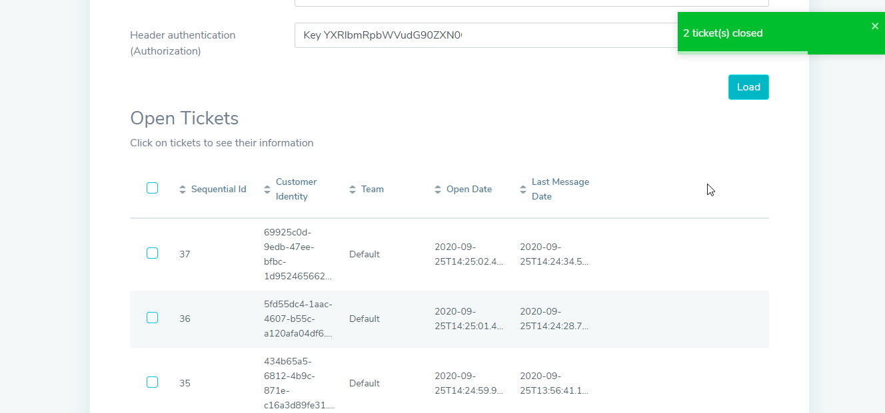

# BLiP - Close Multiple Tickets

 This is a BLiP tool made to help users to close multiple tickets with ease.

 Visit the sample [page here](https://blip-close-multiple-tickets.netlify.app/).

## How can I close the tickets

1. Present your [key authorization](https://help.blip.ai/docs/en/api-sdks/como-encontrar-a-api-key-do-meu-bot/#docsNav) and your Url to send commands and click to load.

2. All tickets will be presented.

3. Click on tickets to see their information, if you want to.

4. Select all tuples that you want and click to close.

5. All tickets selected will be close.

## Getting started from this project

1. Download or clone the project from `git`(the recommended way):

`git clone this repository`

2. Install all packages from npm:

`npm install`

3. Run the project:

`npm start`

4. Now just add the plugin to your chatbot and enjoy!

