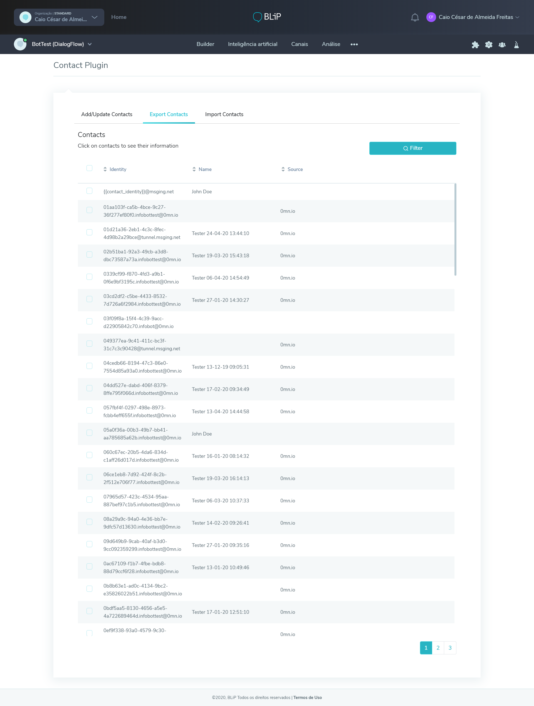
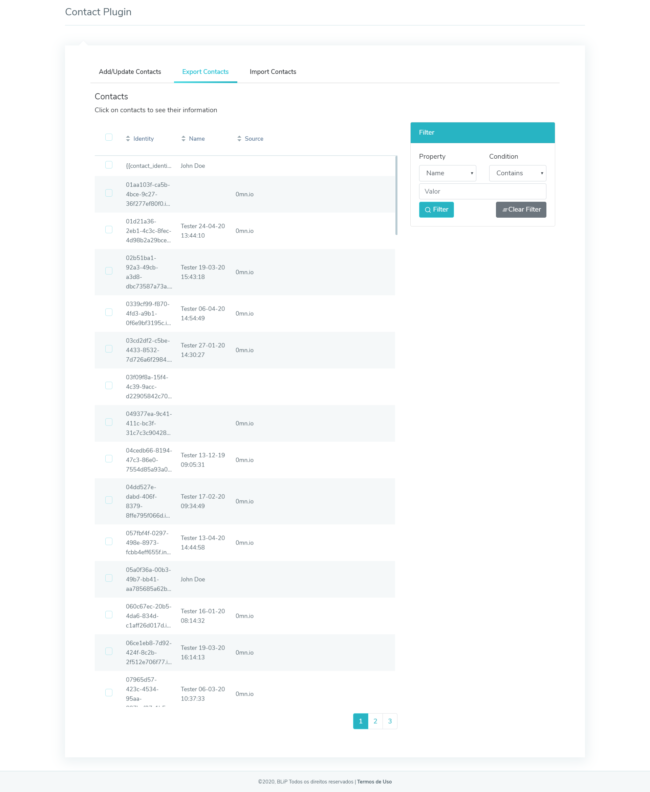
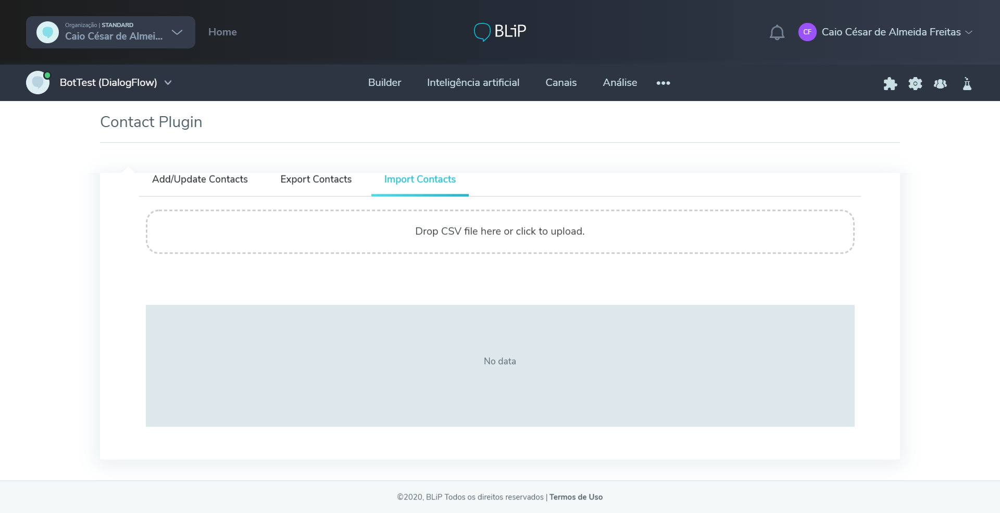
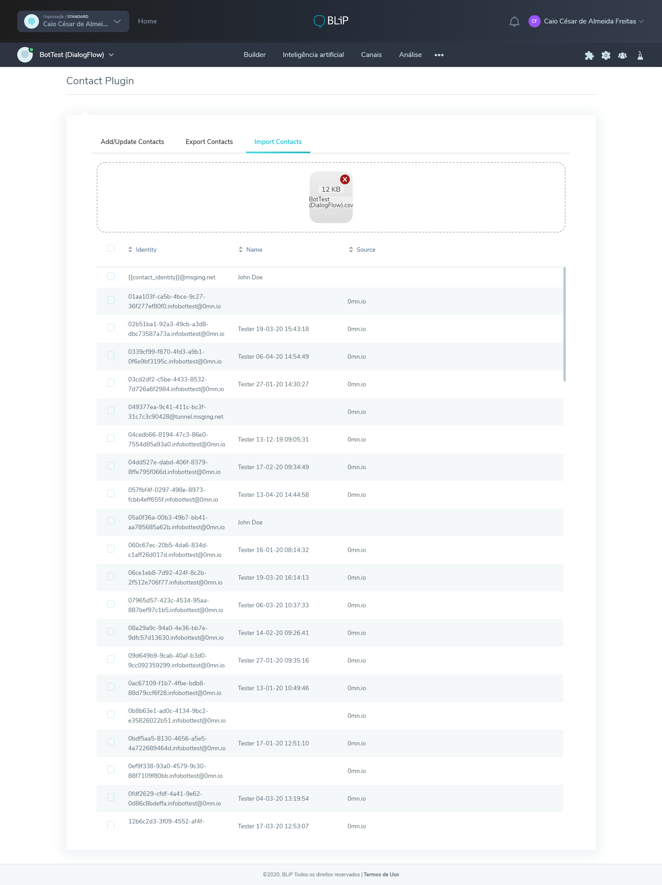
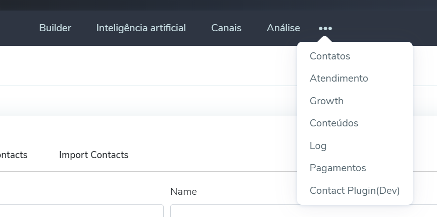

# BLiP Contact Plugin

 This is a BLiP example plugin made to help users manage to add and update contacts with ease.

 Visit the sample [page here](https://blip-contact-plugin.netlify.com/).
 
 ## What is possible to do with this plugin
 
 ### Add/Update a single contact 
Just the field identity is required.
 
 
 
 ### Export Contacts
 
 1. See all the contacts' bot.
 2. Export all the selected contacts into a .csv file.
 
 
 
 1. Filter all the contacts' bot by:
* Name
* Email
* Phone
* City
* Id
* Extras



 1. See all contact information.
 
  ### Import Contacts
  
  
  

## Connecting the plugin to your bot
1. Access your bot's advanced configuration.
2. Set the follow tuple:  
 **Domain**: `postmaster@portal.blip.ai`  
 **Key**: `Plugins`  
 **Value**: 
 ```json
{ 
   "contact-plugin":{ 
      "name":"Contact Plugin",
      "url":"https://blip-contact-plugin.netlify.com/"
   }
}
```

3. Access the following path shown below to use the plugin:



## Getting started from this project

1. Download or clone the project from `git`(the recommended way):

`git clone [...]`

2. Install all packages from npm:

`npm install`

3. Run the project:

`npm start`

4. Now just add the plugin to your chatbot and enjoy!

