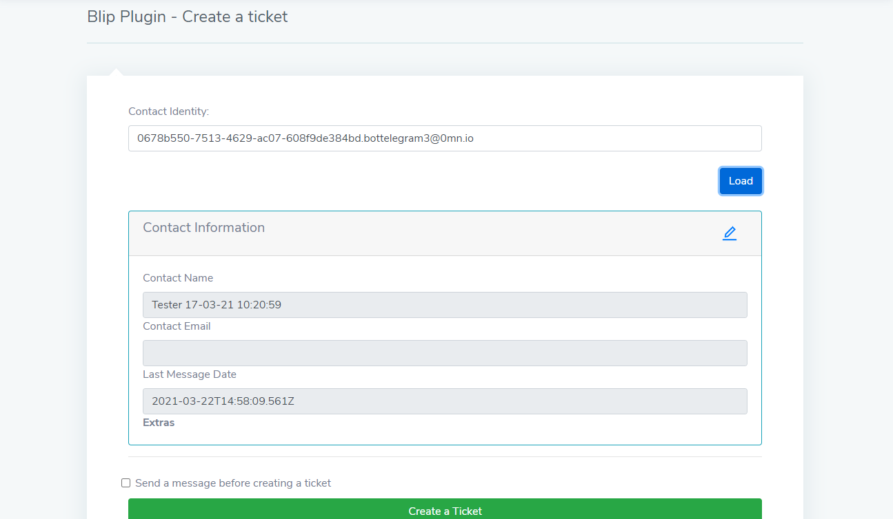
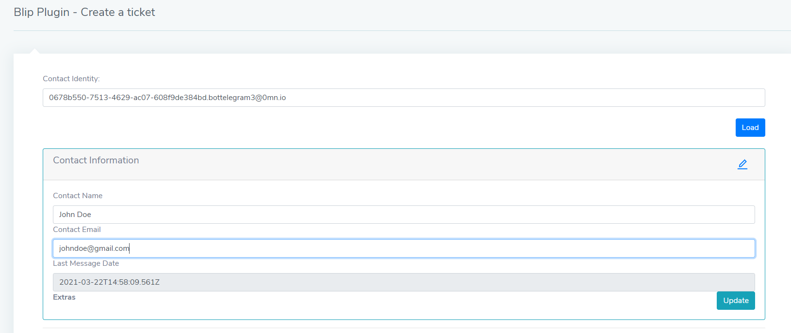
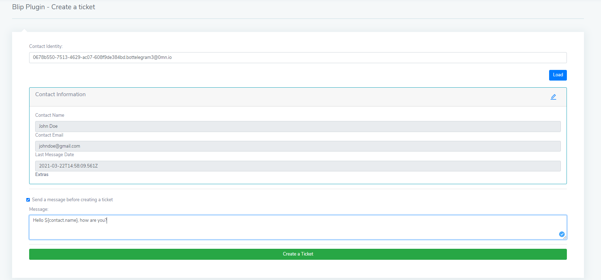
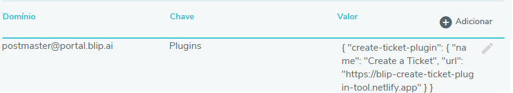
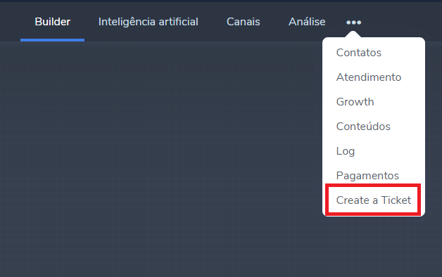
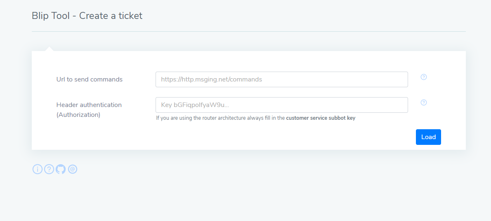
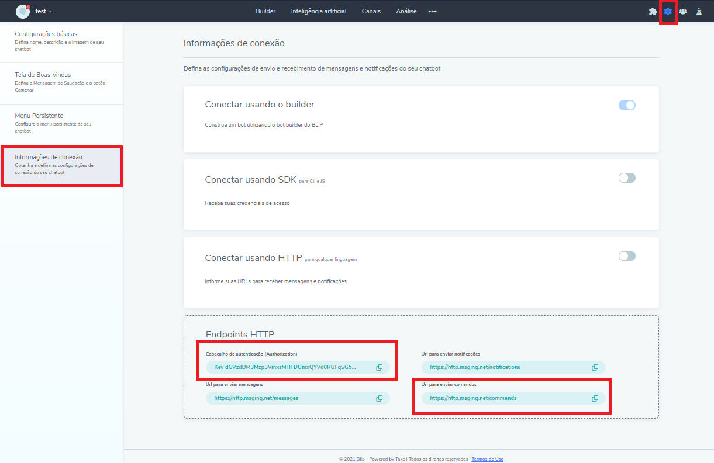

# BLiP Plugin/Tool - Create a ticket

This is a BLiP example plugin/tool designed to help users create tickets whenever they wish for any contact with ease.

Visit the sample [page here](https://blip-create-ticket-plugin-tool.netlify.app).

## What is possible to do with this plugin/tool

1. View all contact information.

 2. Update a contact information.

 3. Send a message after create a ticket.

 4. Create a ticket for any contact.


## Connecting the plugin to your bot

1. Access your bot's advanced configuration.
2. Set the follow tuple:  
   **Domain**: `postmaster@portal.blip.ai`  
   **Key**: `Plugins`  
   **Value**:

```json
{
  "create-ticket-plugin": {
    "name": "Create a Ticket",
    "url": "https://blip-create-ticket-plugin-tool.netlify.app"
  }
}
```

See the result below:


3. Access the following path shown below to use the plugin:



## Using the project as a Tool

1. Access the [url project](https://blip-create-ticket-plugin-tool.netlify.app)
   
2. Fill in the fields key with your bot information, you can find this information following the image bellow:
   
3. Click on load button.

## Getting started from this project

1. Download or clone the project from `git`(the recommended way):

`git clone https://github.com/takenet/blip-tools.git`

2.  Access the project folder:

`cd projectFolder `

3. Install all packages from npm:

`npm install`

4. Run the project:

`npm start`

5. Now just add the plugin to your chatbot and enjoy!
