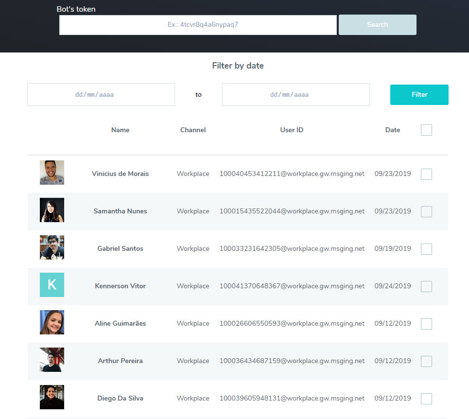

## Conversations viewer - BLiP 

*This is an example of how to use the [BLiP Chat History extension](https://docs.blip.ai/#chat-history) API*

Visit the sample page [here](https://history-blip.herokuapp.com/).

Find and export your contacts' conversation history and threads.

### Instructions

1. Enter bot token (Header authentication - Authorization )
    1. To find your token, go to [BLiP portal](https://portal.blip.ai/)
    2. Select your bot
    3. Access the **Configurations** menu.
    4. Go to the **Connection information** tab
    5. Copy (at **HTTP Endpoints** session) the Header authentication - Authorization key.
2. Click *search* and wait for the page to load
3. Filter by start and end date (*Optional*)
4. Select wich threads you want to export and click *Export button* at the bottom of the page.
5. You will receive a .zip file with two .csv files:
    * A chat-history-{botId}.csv containing message history
    * A threads-{botId}.csv containing threads information

### Future Work
- [ ] Add runtime pagination
- [ ] Improve CSS styles
- [ ] Add a way to open the chat history with [BLiP Components](https://github.com/takenet/blip-cards-vue-components)
- [ ] Add sort
- [ ] Add other filter options