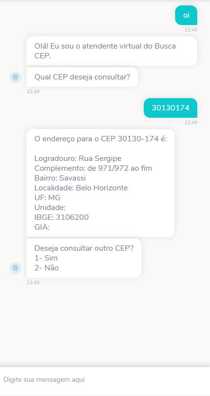
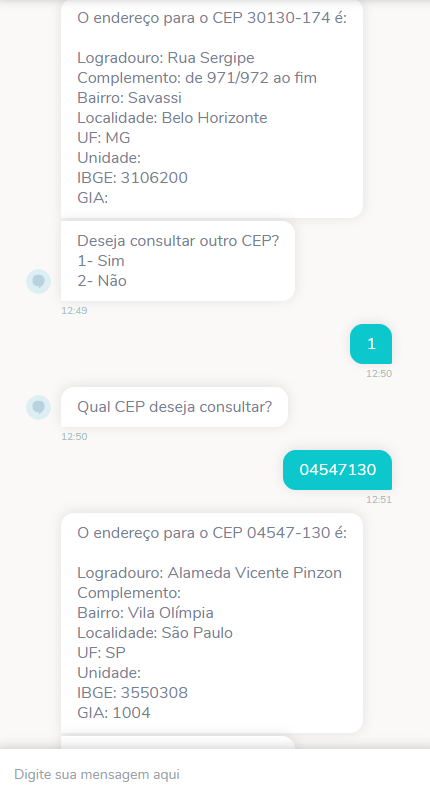

# Address by Zip Code Template

Esse chatbot foi desenvolvido com objetivo de auxilar na utilização APIs de CEP, permitindo assim obter o endereço a partir do CEP apresentado. Tudo isso através de uma interface conversacional compatível com a maioria dos canais disponíveis.

## Exemplo de uso

  

## Como usar
1. [Baixe o fluxo do bot](https://github.com/takenet/blip-tools/blob/master/Templates/Address%20by%20zip%20code%20Template%20(API)/addressByZipCode_template.json)
2. Crie um novo bot e importe o fluxo para ele.
3. Faça as modificações conforme sua necessidade.
