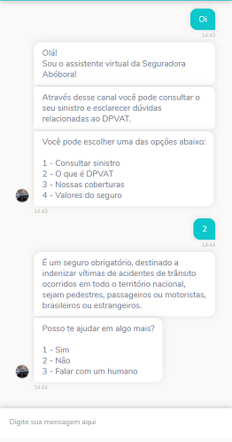
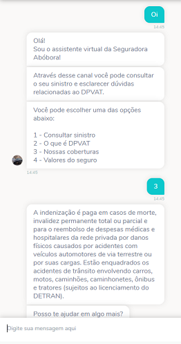
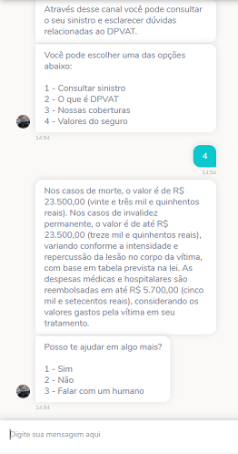

# Seguradora de Carros - template

Esse chatbot foi feito para auxiliar Seguradoras de carros a prestar serviços para seus clientes, dando a eles a opção de checar valores, coberturas, tirar dúvidas e consultar a situação de um sinistro, tanto através do bot como por atendimento humano. Tudo isso através de uma interface conversacional compatível com a maioria dos canais disponíveis.

## Exemplo de uso

  
 

## Como usar
1. Baixe o fluxo do bot
2. Crie um novo bot e importe o fluxo para ele
    * [Importando o fluxo de um bot no Builder](https://help.blip.ai/docs/builder/importando-o-fluxo-de-um-bot-no-builder)
4. No Bloco **Número do Sinistro**, remova o Script de teste e adicione a Requisição para sua **API de consulta ao Sinistro**.
5. Crie as condições de saída baseado nas respostas da sua API
6. Acrescente o retorno da API no Bloco **Sinistro Encontrado**
7. Conecte seu canal de atendimento (ex.: BLiP Desk)
    * [Como ativar o BLiP Desk como canal de atendimento](https://help.blip.ai/docs/helpdesk/blipdesk/como-ativar-blip-desk-canal/)
