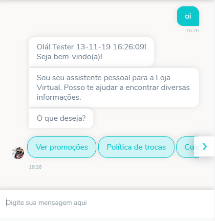
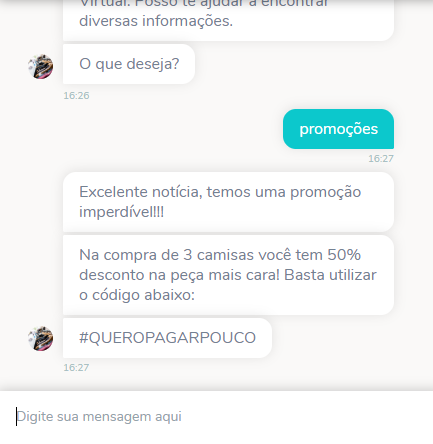
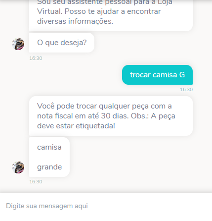
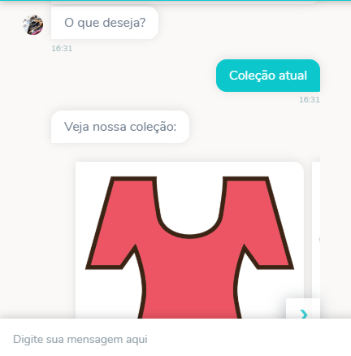
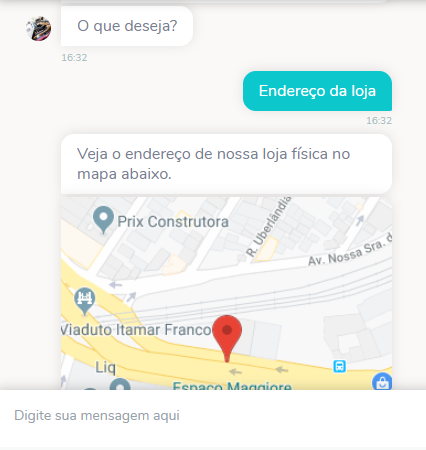

# Clothing Store Template
Esse chatbot foi feito para ajudar Comunidades e Empresas a divulgarem e oferecem suporte e informações sobre um determinado evento em um bot preparado para funcionar com o canal WhatsApp e outros.

## Exemplo de uso

  
  

## Como usar
1. [Baixe o arquivo .zip contendo o fluxo do bot, as intenções e entidades ](https://github.com/takenet/blip-tools/blob/master/Templates/Event%20template%20(multichannel)/event_template.json)
2. Crie um novo bot e importe o fluxo para ele a partir do arquivo **faqlojavirtual.json**.
    * [Importando o fluxo de um bot no Builder](https://help.blip.ai/docs/builder/importando-o-fluxo-de-um-bot-no-builder/)
3. Ative um provedor de sua preferencia:
    * [Como configurar o Watson Assistant como um provedor de Inteligência Artificial](https://help.blip.ai/docs/ai/nlp/como-configurar-watson/)
    * [Como configurar LUIS como um provedor de Inteligência Artificial](https://help.blip.ai/docs/ai/nlp/como-configurar-luis/)
    * [Como configurar o DialogFlow como um provedor de Inteligência Artificial](https://help.blip.ai/docs/ai/nlp/como-configurar-dialogflow/)
4. Importe as intenções a partir do arquivo **faqlojavirtual-intents.csv**
    * [Importar modelo de NLP (intenções e entidades) pré-existente no BLiP](https://help.blip.ai/docs/ai/nlp/importar-modelo-de-intencoes-e-entidades-pre-existente-no-blip/)
5. Importe as entidades a partir do arquivo **faqlojavirtual-entities.csv**
    * [Importar modelo de NLP (intenções e entidades) pré-existente no BLiP](https://help.blip.ai/docs/ai/nlp/importar-modelo-de-intencoes-e-entidades-pre-existente-no-blip/)
6. Treine e publique o modelo de IA
   * [Treinando e publicando seu modelo de inteligência artificial](https://help.blip.ai/docs/ai/nlp/treinando-publicando-modelo-de-ia/)