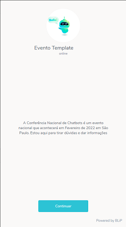
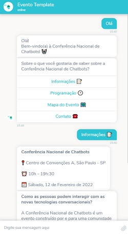
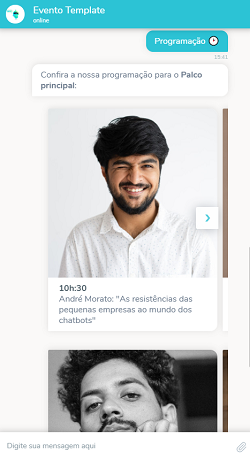
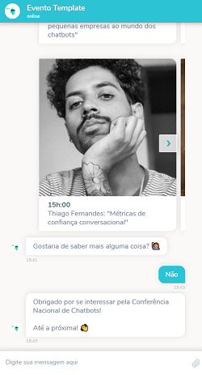

# Evento Template
Esse chatbot foi feito para ajudar Comunidades e Empresas a divulgarem e oferecem suporte e informações sobre um determinado evento em um bot preparado para funcionar com o canal WhatsApp e outros.

## Exemplo de uso

  
 

## Como usar
1. Baixe o fluxo do bot
2. Crie um novo bot e importe o fluxo para ele.

*Obs.: Os blocos representados com o emoji ✅ são destinados exclusivamente ao canal WhatsApp. Usuários que vem deste canal são automaticamente direcionados para esses blocos.*