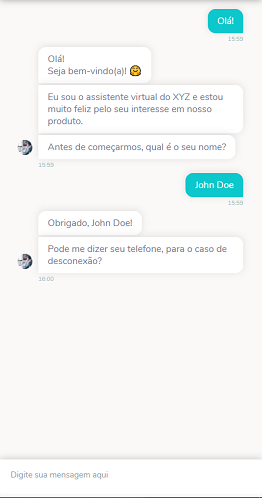
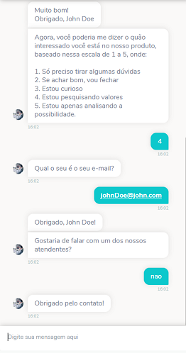
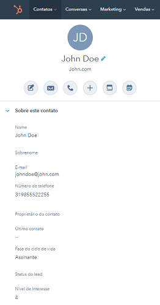

# Prospecção de Clientes - Template

Esse chatbot foi feito para coletar informações sobre leads, como nome, telefone, email e nível de interesse, e enviá-las para sua conta no Hubspot. Além disso, há a portunidade de atendimento humano e uma interface compatível com todos os canais.

##### O que pode ser feito:
* Exibir seus serviços
* Prospectar seus leads
* Integração com o Hubspot.
* Atendimento humano.

## Exemplo de uso

  

## Pré requisitos
* Uma conta no Hubspot
* Uma API Key no Hubspot

## Como usar

1. Baixe o fluxo do bot
2. Importe e faça as modificações necessárias
3. Acesse sua conta no Hubspot
4. Copie sua API Key
    * Dentro no Hubspot, acesse **Configurações > Integrações > Chave de API** e copie (ou crie) a sua chave.
5. Insira sua API Key no seu bot, através da variável de configuração: **HApiKey**.
6. Conecte o seu canal de atendimento humano (Ex.: BLiP Desk)
    * [Como ativar o BLiP Desk como canal de atendimento](https://help.blip.ai/docs/helpdesk/blipdesk/como-ativar-blip-desk-canal/)