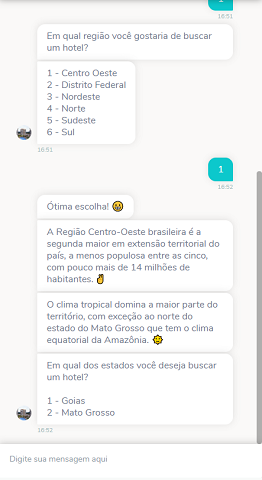
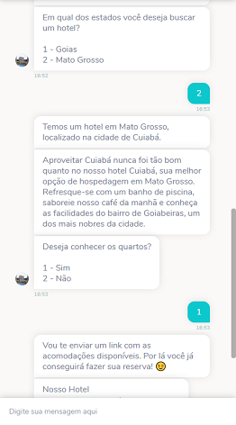
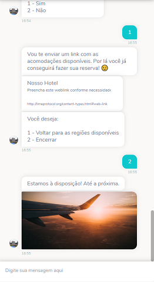

# Rede de Hotéis Template
Esse chatbot foi desenvolvido com propósito de auxiliar as redes de hotéis a prestar servições aos seus clientes dando a eles a opção de buscar hotéis da rede em qualquer região. Tudo isso através de uma interface conversacional compatível com a maioria dos canais disponíveis.

## Exemplo de uso

  
 

## Como usar
1. [Baixe o fluxo do bot](https://github.com/takenet/blip-tools/blob/master/Templates/Hotel%20Chain%20(Multichannel)/rede_de_hoteis.json)
2. Crie um novo bot e importe o fluxo para ele.

