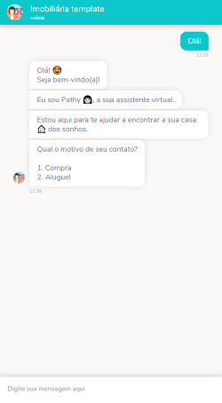
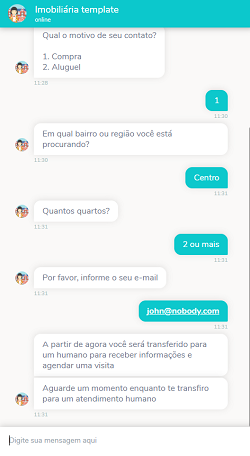
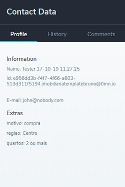
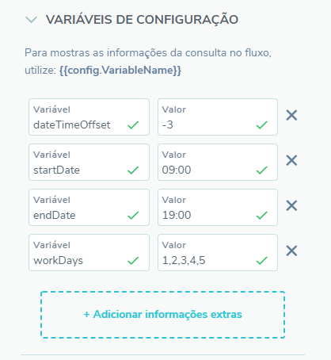

# Imobiliária template

Esse chatbot foi feito para coletar informações sobre clientes que querem comprar ou alugar um imóvel e transferí-los para um atendimento humano.

## Exemplo de uso

  
 

## Como usar
1. [Baixe o fluxo do bot](https://github.com/takenet/blip-tools/blob/master/Templates/Real%20Estate%20(human%20agent)/real_estate.json)
2. Crie um novo bot e importe o fluxo para ele.
3. Defina os horários de atendimento nas variáveis de configuração
    * Horário de início do atendimento : ***startDate (ex.: 09:00)***
    * Horáro de término do atendimento: ***endDate ex.: 18:00)***
    * Dias de atendimento: ***workDays (ex.: 1,2,3,4,5)***
        * Onde cada número representa um dia da semana
        * 0 para domingo, 1 para segunda etc.
    * O seu fuso-horário em relação ao UTC: ***dateTimeOffset (ex.: -3)***

1. Conecte seu canal de atendimento (ex.: BLiP Desk)
    * [Como ativar o BLiP Desk como canal de atendimento](https://help.blip.ai/docs/helpdesk/blipdesk/como-ativar-blip-desk-canal/)
