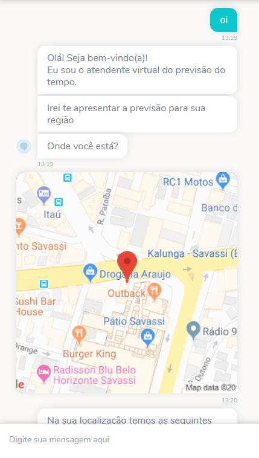
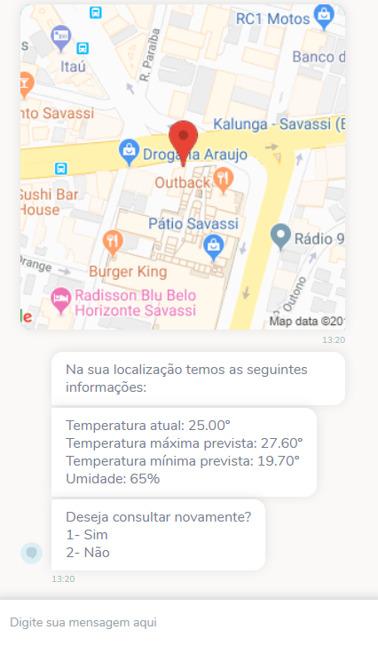
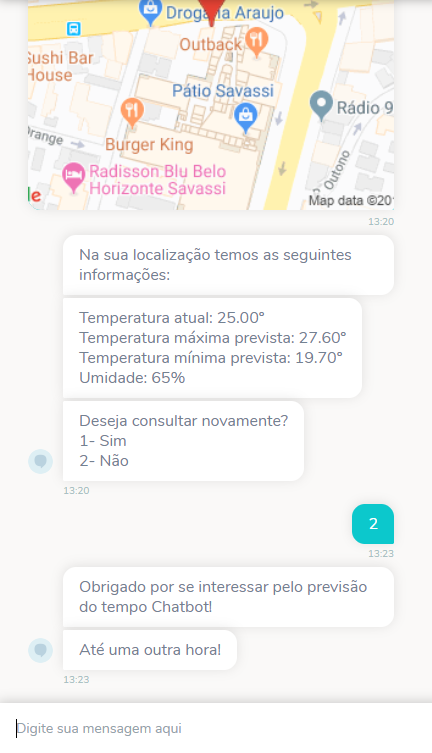

# Weather Forecast Template

Esse chatbot foi desenvolvido com objetivo de auxilar na utilização API's de previsão ou condição do tempo, coletando assim dados como temperatura atual, temperatura máxima prevista, dentre outras. Tudo isso através de uma interface conversacional compatível com a maioria dos canais disponíveis.

## Exemplo de uso

  
 

## Como usar
1. [Baixe o fluxo do bot](https://github.com/takenet/blip-tools/blob/master/Templates/Weather%20Forecast%20Template%20(API)/weatherForecast_template.json)
2. Crie um novo bot e importe o fluxo para ele.
3. Faça as modificações conforme sua necessidade.
